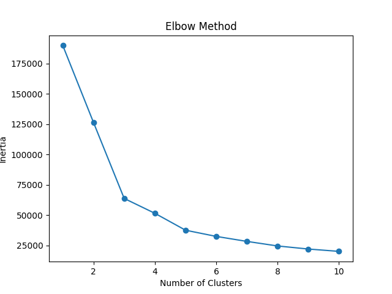

# Customer Segmentation via RFM Analysis & K-Means Clustering

> Unsupervised machine learning pipeline that segments 95,000+ e-commerce customers into behavioral profiles by combining the RFM framework with NLP-based sentiment analysis — enabling data-driven retention and marketing strategies.

---

## Business Problem

Most e-commerce companies treat all customers the same. This project challenges that assumption.

Using transactional data from **Olist** (the largest Brazilian marketplace dataset on Kaggle), this pipeline automatically classifies every customer into one of three strategic segments:

| Segment | Profile | Recommended Action |
|---|---|---|
| **VIP** | High-value customers (avg. spend ~R$721) | Loyalty programs, early access |
| **Regular** | Recent buyers with average spend | Upsell campaigns, cross-sell |
| **At Risk** | Inactive for 390+ days | Win-back email campaigns |

---

## Architecture

The project follows a **modular pipeline design** — each responsibility is isolated in its own module, making it easy to test, maintain and extend.

```
main.py                    <- Orchestrator. Run this.
|
|-- data_prep.py           <- Data ingestion, filtering & type casting
|-- nlp_processing.py      <- Text cleaning & sentiment scoring from reviews
|-- feature_engineering.py <- RFM metric computation + sentiment enrichment
|-- train_model.py         <- Scaling, Elbow Method, K-Means training
|-- analysis.py            <- Cluster profiling & business labeling
```

---

## Methodology

### 1. NLP — Sentiment Scoring

Customer review scores (1–5 stars) are mapped to a continuous sentiment scale and review text is cleaned using regex and NLTK stopwords. The resulting `avg_sentiment` score is attached to each customer as an enrichment feature — used for analysis, not for clustering.

| Review Score | Sentiment Value |
|---|---|
| 1 star | -1.0 (very negative) |
| 2 stars | -0.5 |
| 3 stars | 0.0 (neutral) |
| 4 stars | +0.5 |
| 5 stars | +1.0 (very positive) |

### 2. Feature Engineering — RFM

Three behavioral signals are extracted per customer from raw transactional records:

| Metric | Description | Aggregation |
|---|---|---|
| **Recency** | Days since last purchase | `max(order_date)` delta from reference date |
| **Frequency** | Number of unique orders | `nunique(order_id)` |
| **Monetary** | Total amount spent (R$) | `sum(price)` |

> **Key design decision — Reference Date:** The reference date is `max(purchase_date) + 1 day`, not `today()`. The Olist dataset ends in 2018; using the system clock would make every customer appear inactive for years, making recency meaningless.

> **Key design decision — Outlier Removal:** Customers above the 99th percentile in monetary value are excluded before clustering. A single customer with R$107,520 in spend was capturing an entire cluster on its own, defeating the segmentation.

### 3. Preprocessing

RFM features are standardized with `StandardScaler` (zero mean, unit variance). Without this step, monetary values (R$ hundreds) would numerically dominate recency (days) and distort cluster geometry.

`avg_sentiment` is intentionally excluded from the scaling step — it is used as a post-clustering analysis dimension, not as a clustering input. Including it forced the model to create sentiment-based clusters rather than behavioral ones.

### 4. Optimal K — Elbow Method

A K-Means loop from K=1 to K=10 plots inertia (within-cluster sum of squares) against number of clusters. The inflection point at **K=3** was selected.



### 5. Clustering — K-Means

Final model trained with `n_clusters=3` and `random_state=42` for reproducibility.

---

## Results

```
Cluster Profiles (mean values per segment):

           recency    frequency    monetary    avg_sentiment
Regular    130 days      1.0        R$ 107        +0.59
VIP        233 days      1.0        R$ 721        +0.44
At Risk    390 days      1.0        R$ 110        +0.60
```

```
Customer Distribution:

Regular     51,263   (54.0%)
At Risk     37,756   (39.8%)
VIP          5,851    (6.2%)
```

**Key finding — Monetary:** VIP customers are defined entirely by spend (~7x higher), not by recency or frequency. They are mid-cycle buyers who happen to purchase high-ticket items.

**Key finding — Sentiment:** Average sentiment is uniformly positive across all three segments (+0.44 to +0.60). This indicates that churn in the At Risk group is not driven by dissatisfaction — suggesting product category (one-time purchases) or lifecycle factors as the root cause.

---

## How to Run

### Option 1 — Local

```bash
pip install -r requirements.txt
python main.py
```

### Option 2 — Docker

```bash
docker build -t rfm-project .
docker run rfm-project
```

### Dataset

Download the [Olist dataset from Kaggle](https://www.kaggle.com/datasets/olistbr/brazilian-ecommerce) and place the following files in a `datasets/` folder:

```
datasets/
|-- olist_orders_dataset.csv
|-- olist_order_items_dataset.csv
|-- olist_order_reviews_dataset.csv
```

---

## Tech Stack

| Tool | Purpose |
|---|---|
| `pandas` | Data manipulation and feature aggregation |
| `scikit-learn` | StandardScaler, KMeans |
| `matplotlib` | Elbow Method visualization |
| `nltk` | Text preprocessing for review analysis |
| `Docker` | Containerized, reproducible execution |

---

## Project Structure

```
.
|-- main.py                  # Entry point
|-- data_prep.py             # ETL layer
|-- nlp_processing.py        # Sentiment extraction
|-- feature_engineering.py  # RFM + sentiment merge
|-- train_model.py           # ML pipeline
|-- analysis.py              # Business interpretation
|-- Dockerfile               # Container definition
|-- requirements.txt         # Pinned dependencies
|-- elbow_method.png         # Cluster selection chart
|-- datasets/                # Raw data (not versioned)
```